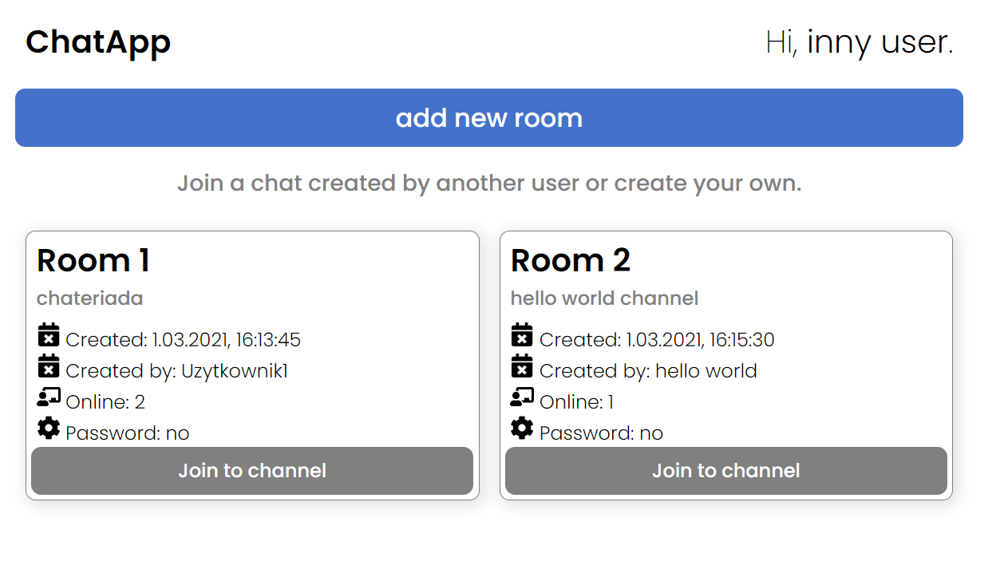
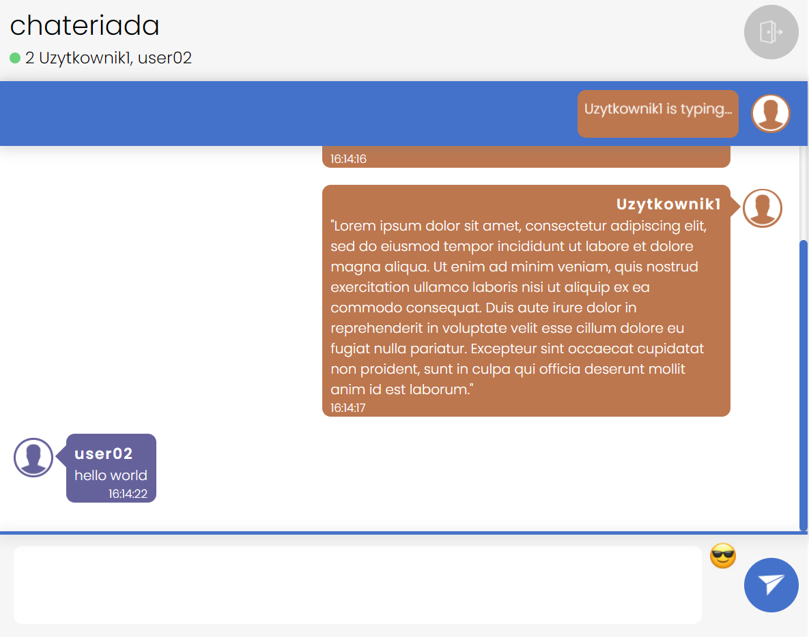

# socket.io-chat-app 

#### Chat app using React.js and socket.io. 
> Chat application with rooms.

## 🔎 Demo

Click to test the app: https://socketio-chat-app-client.herokuapp.com/

More in address above!

## 📚 Features
- A user account is exist only when he is connect (block connect someobody with the same name),
- Rooms (private - protected by password and public),
- Random chat color for every user (generated on join),
- Typing notifications (real time - when user is writting a message),
- Refresh channels and users list real time,
- Room is empty = it'll be delete,
- Display messages list had written before user join to the room,
- Chat emoticons

## 🕹️ Technologies

### Client
- react framework 16.8^,
- socket.io client,
- react router,
- react icons,
- toastify,
- styled-components

####Server
- node.js,
- express.js,
- socket.io

